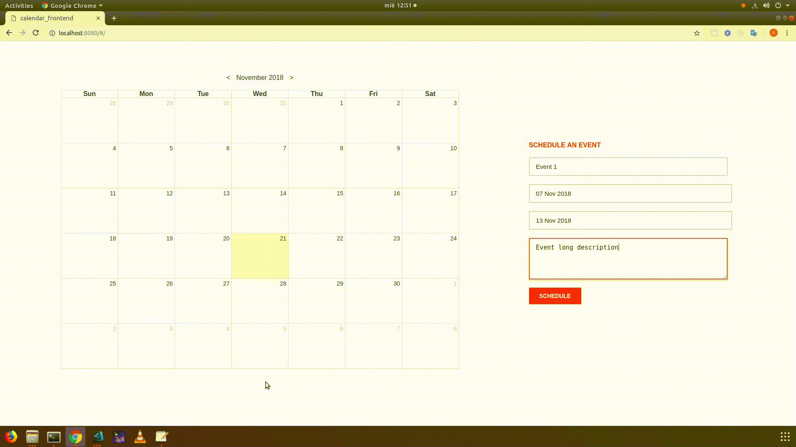

### Getting Started

This is a Ruby on rails 5 Calendar example. You can have a look at the video below. You can find the front-end example chat made with vuejs at https://github.com/cannyedge34/calendar-front-end.git

This project was bootstrapped with Ruby on Rails 5. It is not tested in production environment, it is just an example app. So, use it under your responsibility.



Checkout this repo, install dependencies, then start rails server with the following:

```
> git clone https://github.com/cannyedge34/calendar-back-end.git
> cd calendar-back-end
> bundle install
> rails db:migrate
> rails s
```

``` 
1. Instructions
  Install httpie from https://httpie.org/ or postman from https://www.getpostman.com/
4. Create a new event
  http --form POST :3000/events title="Event 1" start_date="Tue, 20 Nov 2018" end_date="Thu, 22 Nov 2018" description="Description of event 1" 
6. Get all events
  http :3000/events
```

**All test are passed. You should run:**

```
bundle exec rspec
```
